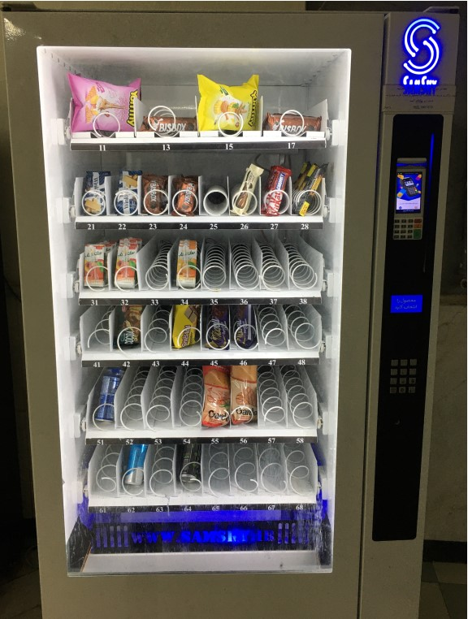

# Vending Machine in Verilog

This project contains Verilog code for a vending machine that simulates the functionality of a real vending machine.

## Features

- Accepts various coins and bills
- Product selection
- Dispenses change
- Displays inventory and machine status

## Project Structure

- `vending_machine.v`: The main Verilog file implementing the vending machine logic.
- `testbench.v`: The testbench file for testing and simulating the vending machine's functionality.

## How to Use

1. Clone the repository:

    ```bash
    git clone https://github.com/Hossein8201/vending_machine.git
    cd vending_machine
    ```

2. Load the Verilog files into your Verilog simulator (e.g., ModelSim or Icarus Verilog).

3. Run the `testbench.v` file to test and simulate the vending machine's operation.

4. Make any necessary changes to the Verilog code and re-simulate.

## Sample Image

To display an image of the vending machine, first upload the image to your repository. Then, replace the link below with the path to your image:



## Contribution

If you would like to contribute to this project, we would love to hear from you. Please open an issue or submit a pull request.

## License

This project is licensed under the MIT License. For more information, please refer to the [LICENSE](LICENSE) file.
